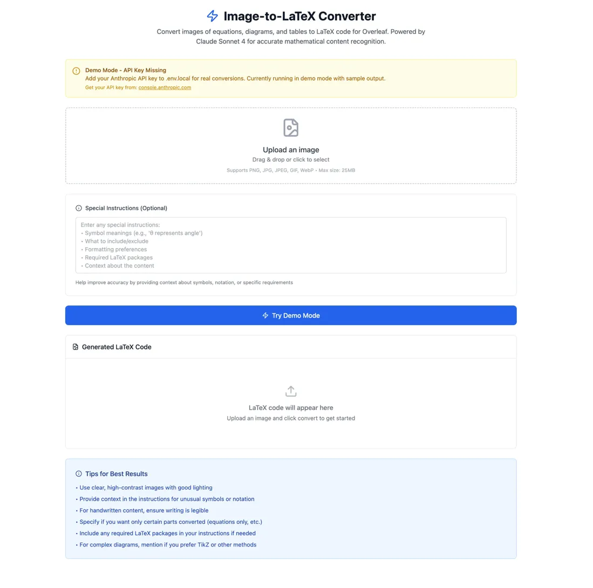

# Image-to-LaTeX Converter

## Overview

A React-based web application that converts images containing mathematical equations, diagrams, and tables into clean LaTeX code using Anthropic's Claude Sonnet 4. This tool is designed for students, researchers, and academics who need to digitize mathematical content for use in LaTeX documents, papers, or Overleaf projects.

## Features

### Core Functionality
- **Image Upload**: Drag & drop or click-to-select file upload
- **AI Conversion**: Powered by Claude Sonnet 4 for accurate mathematical content recognition
- **Custom Instructions**: Optional user instructions to improve conversion accuracy
- **Demo Mode**: Test the interface without an API key using sample output
- **Copy to Clipboard**: One-click copying of generated LaTeX code
- **File Validation**: Comprehensive validation for file size and format

### Technical Features
- **Responsive Design**: Works on desktop and mobile devices
- **Real-time Feedback**: Loading states, progress indicators, and error messages
- **File Management**: Support for multiple image formats with size limits
- **Environment Configuration**: Secure API key management through environment variables

## Live Demo


## Technical Architecture

### Frontend Stack
```
React 18+           - Core framework with functional components and hooks
Tailwind CSS        - Utility-first CSS framework (loaded via CDN)
Lucide React        - Modern icon library
JavaScript ES6+     - Modern JavaScript features
```

### API Integration
```
Anthropic Claude API - Claude Sonnet 4 model for image analysis
Base64 Encoding     - Image format for API transmission
Fetch API           - HTTP client for API communication
```

### File Structure
```
image-to-latex-converter/
├── public/
│   ├── index.html          # HTML template
│   ├── manifest.json       # PWA manifest
│   └── robots.txt          # SEO robots file
├── src/
│   ├── components/
│   │   └── ImageToLatexConverter.js  # Main component
│   ├── App.js              # App wrapper component
│   ├── App.css             # Legacy CSS (minimal usage)
│   ├── index.js            # React entry point
│   ├── index.css           # Global styles with Tailwind imports
│   └── setupTests.js       # Jest configuration
├── .gitignore              # Git ignore rules
├── package.json            # Dependencies and scripts
└── README.md               # This file
```

## Component Analysis

### ImageToLatexConverter.js - Main Component

#### State Management
```javascript
const [image, setImage] = useState(null);           // Uploaded file object
const [imagePreview, setImagePreview] = useState(null); // Base64 preview URL
const [instructions, setInstructions] = useState(''); // User instructions
const [latexCode, setLatexCode] = useState('');     // Generated LaTeX output
const [isConverting, setIsConverting] = useState(false); // Loading state
const [copySuccess, setCopySuccess] = useState(false); // Copy feedback
const [error, setError] = useState('');             // Error messages
const [dragActive, setDragActive] = useState(false); // Drag state
```

#### Key Functions

**File Validation**
```javascript
const validateFile = (file) => {
  // Checks file existence, format, and size
  // Supports: PNG, JPG, JPEG, GIF, WebP
  // Max size: 25MB (configurable)
}
```

**Image Processing**
```javascript
const handleImageUpload = (file) => {
  // Validates file
  // Creates preview using FileReader API
  // Stores file object for later processing
}
```

**API Communication**
```javascript
const convertToLatex = async () => {
  // Converts image to base64
  // Constructs prompt with user instructions
  // Sends request to Claude API
  // Handles response and errors
}
```

#### Environment Configuration
```javascript
const getEnvVar = (name, defaultValue = '') => {
  // Safely accesses process.env variables
  // Provides fallbacks for missing variables
  // Handles cases where process is undefined
}
```

## Installation and Setup

### Prerequisites
- Node.js (v16 or higher)
- npm or yarn package manager
- Anthropic API key (for real conversions)

### Step-by-Step Installation

#### 1. Clone the Repository
```bash
git clone https://github.com/anshulk-cmu/image-to-latex-converter.git
cd image-to-latex-converter
```

#### 2. Install Dependencies
```bash
npm install
```

This installs:
- `react` and `react-dom` (v19.1.1) - Core React framework
- `lucide-react` (v0.544.0) - Icon library
- `react-scripts` (v5.0.1) - Build tools and development server
- Testing utilities and web vitals

#### 3. Environment Setup
Create a `.env.local` file in the project root:
```bash
touch .env.local
```

Add your configuration:
```env
# Required for real conversions
REACT_APP_ANTHROPIC_API_KEY=your_api_key_here

# Optional configuration
REACT_APP_MAX_FILE_SIZE_MB=25
```

#### 4. Start Development Server
```bash
npm start
```

The application will open at `http://localhost:3000`

### Getting an Anthropic API Key

1. Visit [console.anthropic.com](https://console.anthropic.com/)
2. Create an account or sign in
3. Navigate to API Keys section
4. Generate a new API key
5. Copy the key (starts with `sk-ant-api03-`)
6. Add to your `.env.local` file

## Usage Guide

### Basic Usage

1. **Upload Image**
   - Drag and drop an image onto the upload area
   - Or click to select a file from your computer
   - Supported formats: PNG, JPG, JPEG, GIF, WebP
   - Maximum size: 25MB

2. **Add Instructions (Optional)**
   - Provide context about symbols or notation
   - Specify desired LaTeX environments
   - Include any special requirements
   - Example: "Use align environment for multiple equations"

3. **Convert**
   - Click "Convert to LaTeX" (with API key)
   - Or "Try Demo Mode" (without API key)
   - Wait for processing to complete

4. **Copy and Use**
   - Click "Copy Code" to copy generated LaTeX
   - Paste into Overleaf, LaTeX editor, or document

### Demo Mode

When no API key is configured, the application runs in demo mode:
- Simulates API processing with a 2-second delay
- Returns sample LaTeX code demonstrating the output format
- Allows testing of all interface features
- Shows what real output would look like

### Advanced Usage

#### Custom Instructions Examples
```
Symbol meanings:
- θ represents angle
- μ represents coefficient of friction
- ∑ indicates summation from i=1 to n

Formatting preferences:
- Use align environment for multiple equations
- Include \usepackage{amsmath} and \usepackage{amssymb}
- Add comments explaining each step

Context:
- This is from a physics mechanics problem
- Focus only on the mathematical equations
- Ignore any handwritten notes in margins
```

#### Supported Content Types
- **Handwritten equations** - Mathematical formulas written by hand
- **Printed formulas** - Equations from textbooks or papers
- **Simple tables** - Data tables with mathematical content
- **Basic diagrams** - Simple mathematical diagrams and figures
- **Mixed content** - Combination of equations, text, and diagrams

## API Integration Details

### Request Format
```javascript
{
  model: "claude-sonnet-4-20250514",
  max_tokens: 2000,
  messages: [{
    role: "user",
    content: [
      {
        type: "image",
        source: {
          type: "base64",
          media_type: "image/jpeg", // Actual file MIME type
          data: "base64-encoded-image-data"
        }
      },
      {
        type: "text",
        text: "Detailed prompt with instructions..."
      }
    ]
  }]
}
```

### Response Handling
```javascript
// Success response structure
{
  content: [{
    type: "text",
    text: "Generated LaTeX code here..."
  }],
  // ... other metadata
}

// Error handling for common scenarios
- 401: Invalid API key
- 403: Insufficient permissions
- 429: Rate limit exceeded
- Network errors: Connection issues
```

### Prompt Engineering

The application uses a carefully crafted prompt:

```
Please analyze this image and convert it to LaTeX code suitable for Overleaf.

IMPORTANT INSTRUCTIONS:
- Generate clean, properly formatted LaTeX code
- Use standard LaTeX packages when needed (\usepackage{} statements)
- For equations, use appropriate math environments ($$, \begin{equation}, \begin{align}, etc.)
- For tables, use tabular environment with proper alignment
- For diagrams, provide TikZ code if possible, otherwise describe what's needed
- Ensure the code is copy-paste ready for Overleaf
- Include necessary package imports at the top if needed
- Use proper spacing and indentation
- Add comments for complex sections

[User instructions inserted here if provided]

Respond with ONLY the LaTeX code, no explanations or markdown formatting.
```

## Security Considerations

### Current Implementation (Development Only)
- API key stored in environment variables
- Client-side only implementation
- No server-side validation
- Direct API calls from browser

### Security Limitations
- **API Key Exposure**: The API key is accessible in the browser
- **CORS Requirements**: Limited by browser same-origin policies
- **Rate Limiting**: No built-in rate limiting protection
- **Input Validation**: Limited to client-side validation only

### Production Security Requirements

For production deployment, implement:

1. **Backend API Server**
   ```
   Frontend → Backend Server → Anthropic API
   ```

2. **Authentication System**
   ```javascript
   // Example backend endpoint
   POST /api/convert-image
   Headers: Authorization: Bearer <user-token>
   Body: { image: base64Data, instructions: string }
   ```

3. **Rate Limiting**
   ```javascript
   // Per-user rate limiting
   const rateLimit = {
     windowMs: 15 * 60 * 1000, // 15 minutes
     max: 10 // limit each user to 10 requests per windowMs
   };
   ```

4. **Input Sanitization**
   ```javascript
   // Server-side validation
   const validateImageUpload = (file) => {
     // Verify file type using magic numbers
     // Scan for malicious content
     // Enforce size limits
     // Validate base64 encoding
   };
   ```

## Error Handling

### Client-Side Error Types

1. **File Validation Errors**
   - Invalid file format
   - File size exceeded
   - Corrupted files
   - Empty uploads

2. **API Errors**
   - Network connectivity issues
   - Invalid API key
   - Rate limiting
   - Service unavailable

3. **Processing Errors**
   - Image reading failures
   - Base64 encoding errors
   - Clipboard access denied

### Error Recovery Strategies

```javascript
// Retry mechanism for network errors
const retryApiCall = async (apiCall, maxRetries = 3) => {
  for (let i = 0; i < maxRetries; i++) {
    try {
      return await apiCall();
    } catch (error) {
      if (i === maxRetries - 1) throw error;
      await new Promise(resolve => setTimeout(resolve, 1000 * (i + 1)));
    }
  }
};

// Graceful degradation for clipboard API
const copyToClipboard = async (text) => {
  try {
    await navigator.clipboard.writeText(text);
  } catch (err) {
    // Fallback for older browsers
    const textArea = document.createElement('textarea');
    textArea.value = text;
    document.body.appendChild(textArea);
    textArea.select();
    document.execCommand('copy');
    document.body.removeChild(textArea);
  }
};
```

## Performance Optimization

### Current Optimizations

1. **Lazy Loading**
   - Components loaded only when needed
   - Icon library tree-shaking

2. **Memory Management**
   - Image preview URLs properly cleaned up
   - Event listeners removed on unmount

3. **File Processing**
   - Efficient base64 conversion
   - Progress feedback during processing

### Potential Improvements

1. **Image Preprocessing**
   ```javascript
   // Compress large images before upload
   const compressImage = (file, maxWidth = 1920, quality = 0.8) => {
     // Canvas-based image compression
     // Reduce file size while maintaining quality
   };
   ```

2. **Caching**
   ```javascript
   // Cache recent conversions
   const conversionCache = new Map();
   const cacheKey = generateImageHash(imageData);
   ```

3. **Background Processing**
   ```javascript
   // Use Web Workers for heavy processing
   const worker = new Worker('image-processor.js');
   worker.postMessage({ imageData, instructions });
   ```

## Testing

### Current Test Setup
- Jest testing framework
- React Testing Library
- Basic smoke tests included

### Test Coverage Areas

1. **Component Testing**
   ```javascript
   // Example test cases
   - Image upload functionality
   - Form validation
   - Error state handling
   - Copy to clipboard
   ```

2. **Integration Testing**
   ```javascript
   // API integration tests
   - Mock API responses
   - Error scenario testing
   - Loading state verification
   ```

3. **End-to-End Testing**
   ```javascript
   // Full user workflow tests
   - Complete conversion process
   - File upload and processing
   - Result validation
   ```

### Running Tests
```bash
npm test                    # Run all tests
npm test -- --coverage    # Run with coverage report
npm test -- --watch       # Run in watch mode
```

## Browser Compatibility

### Supported Browsers
- **Chrome**: v88+ (Full support)
- **Firefox**: v85+ (Full support)
- **Safari**: v14+ (Full support)
- **Edge**: v88+ (Full support)

### Feature Requirements
- **FileReader API**: Image processing
- **Fetch API**: HTTP requests
- **Clipboard API**: Copy functionality (with fallback)
- **CSS Grid/Flexbox**: Layout
- **ES6+ Features**: Modern JavaScript

## Deployment Options

### Local Development
```bash
npm start                   # Development server
npm run build              # Production build
npm run test               # Test suite
```

### Static Hosting (Client-Only)
```bash
npm run build
# Deploy build/ folder to:
# - Netlify
# - Vercel
# - GitHub Pages
# - AWS S3 + CloudFront
```

### Full-Stack Deployment
```bash
# Backend deployment (Node.js/Express)
# Frontend deployment (Static hosting)
# Environment variable configuration
# SSL certificate setup
```

## Contributing

### Development Workflow

1. **Fork the repository**
2. **Create feature branch**
   ```bash
   git checkout -b feature/new-functionality
   ```

3. **Make changes**
   - Follow existing code style
   - Add appropriate tests
   - Update documentation

4. **Test thoroughly**
   ```bash
   npm test
   npm run build
   ```

5. **Submit pull request**
   - Clear description of changes
   - Reference any related issues
   - Include screenshots if UI changes

### Code Style Guidelines

1. **React Best Practices**
   - Functional components with hooks
   - Proper dependency arrays for useEffect
   - Meaningful component and variable names

2. **Error Handling**
   - Comprehensive try-catch blocks
   - User-friendly error messages
   - Graceful degradation

3. **Performance**
   - Avoid unnecessary re-renders
   - Optimize large file handling
   - Implement proper loading states

## License

MIT License - see LICENSE file for details.

## Acknowledgments

- **Anthropic** - Claude Sonnet 4 API
- **Tailwind CSS** - Utility-first CSS framework
- **Lucide** - Beautiful icon library
- **React Team** - Frontend framework
- **Create React App** - Project bootstrapping

## Support and Issues

### Common Issues

1. **API Key Problems**
   - Verify key is correctly set in `.env.local`
   - Check key permissions in Anthropic console
   - Ensure sufficient API credits

2. **File Upload Issues**
   - Check file size (max 25MB)
   - Verify supported format
   - Clear browser cache

3. **Conversion Quality**
   - Use clear, high-contrast images
   - Provide detailed instructions
   - Try different image orientations

### Getting Help

1. **Check existing issues** on GitHub
2. **Search documentation** for common solutions
3. **Create new issue** with:
   - Detailed problem description
   - Steps to reproduce
   - Browser and OS information
   - Error messages or screenshots

### Feature Requests

We welcome suggestions for new features:
- LaTeX preview rendering
- Batch image processing
- Additional export formats
- Mobile app version
- Collaborative features

## Roadmap

### Short-term Goals (Next Release)
- Enhanced error messaging
- Improved mobile responsiveness
- Better file format support
- Performance optimizations

### Medium-term Goals (3-6 months)
- Real-time LaTeX preview
- Batch processing capabilities
- User authentication system
- Cloud storage integration

### Long-term Goals (6+ months)
- Mobile application
- Collaborative editing
- Advanced mathematical symbol recognition
- Integration with popular LaTeX editors

---

## Quick Reference

### Environment Variables
```env
REACT_APP_ANTHROPIC_API_KEY=sk-ant-api03-...
REACT_APP_MAX_FILE_SIZE_MB=25
```

### Key Commands
```bash
npm install                 # Install dependencies
npm start                   # Start development server
npm run build              # Create production build
npm test                   # Run test suite
```

### File Limits
- Maximum size: 25MB
- Supported formats: PNG, JPG, JPEG, GIF, WebP
- Recommended resolution: 1920px width maximum

### API Information
- Model: claude-sonnet-4-20250514
- Max tokens: 2000
- Rate limits: As per Anthropic API limits
- Cost: Based on Anthropic pricing tiers